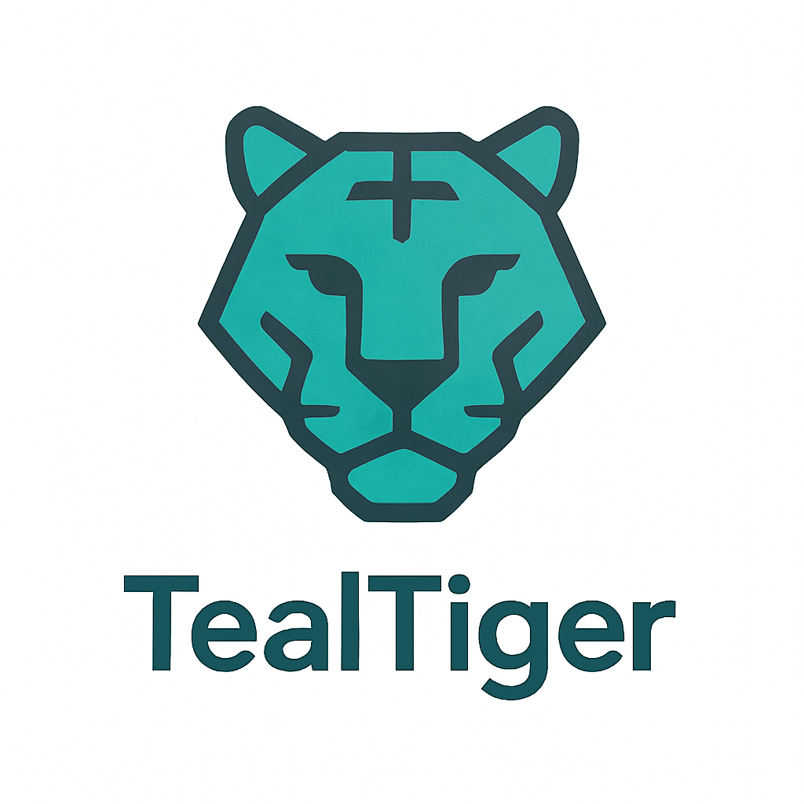

<div align="center">
  <picture>
    <source media="(prefers-color-scheme: dark)" srcset=".github/logo/tealtiger-logo-dark.png">
    <source media="(prefers-color-scheme: light)" srcset=".github/logo/tealtiger-logo-light.png">
    
  </picture>
  
  # TealTiger Python SDK
  
  > The first open-source AI agent security SDK with **client-side guardrails** 🛡️
  
  [](https://pypi.org/project/tealtiger/)
  [](https://pypi.org/project/tealtiger/)
  [](https://github.com/agentguard-ai/tealtiger-python/actions/workflows/test.yml)
  [](https://opensource.org/licenses/Apache-2.0)
  [](https://docs.tealtiger.ai)
</div>

> 📖 **[Read the introduction blog post](https://dev.to/nagasatish_chilakamarti_2/introducing-tealtiger-ai-security-cost-control-made-simple-4lma)** to learn more about TealTiger!

## ✨ What's New in v1.1.0

**Multi-Provider Support** — 95%+ market coverage with 7 LLM providers!

- 🔌 **TealOpenAI** — Drop-in replacement for OpenAI client
- 🔌 **TealAnthropic** — Drop-in replacement for Anthropic client
- 🔌 **TealGemini** — Google Gemini with multimodal support
- 🔌 **TealBedrock** — AWS Bedrock (Claude, Titan, Jurassic, Command, Llama)
- 🔌 **TealAzureOpenAI** — Azure OpenAI with deployment support
- 🔌 **TealMistral** — Mistral AI with European data residency
- 🔌 **TealCohere** — Cohere with RAG and embeddings
- 🛡️ **TealEngine** — Policy evaluation with deterministic decisions
- 🔒 **TealGuard** — Security guardrails (PII, prompt injection, content moderation)
- ⚡ **TealCircuit** — Circuit breaker for cascading failure prevention
- 📊 **TealAudit** — Audit logging with redaction-by-default
- 💰 **Cost Tracking** — Monitor costs across 50+ models

**Cost Tracking & Guarded AI Clients** - Complete feature parity with TypeScript SDK!

- 💰 **Cost Tracking** - Track AI costs across OpenAI, Anthropic, Azure OpenAI
- 📊 **Budget Management** - Set budgets with alerts and automatic enforcement
- 🛡️ **Guarded Clients** - Drop-in replacements with integrated security
- 🔒 **TealOpenAI** - Secure OpenAI client with guardrails + cost tracking
- 🔒 **TealAnthropic** - Secure Anthropic client with guardrails + cost tracking
- 🔒 **TealAzureOpenAI** - Secure Azure OpenAI with deployment mapping
- ⚡ **20+ Models** - Accurate pricing for GPT-4, Claude 3, and more

## ✨ What's New in v0.2.0

**Client-Side Guardrails** - Run security checks directly in your application without server calls!

- 🔍 **PII Detection** - Detect and protect emails, phones, SSNs, credit cards
- 🛡️ **Content Moderation** - Block harmful content (hate speech, violence, harassment)
- 🚫 **Prompt Injection Prevention** - Prevent jailbreak and instruction attacks
- ⚡ **Offline** - No server dependency, works anywhere
- 🚀 **Fast** - Runs in milliseconds

## 🏢 Enterprise-Ready Features (v1.1.x)

TealTiger v1.1.x introduces five P0 enterprise features that transform TealTiger from a developer tool into an enterprise-ready AI security platform:

### 🎯 Policy Rollout Modes

Deploy AI security policies gradually with three enforcement levels:

```python
from tealtiger import TealEngine, PolicyMode

# Development: Monitor everything
dev_engine = TealEngine(
    policies=my_policies,
    mode={
        "default_mode": PolicyMode.MONITOR
    }
)

# Staging: Enforce critical, monitor others
staging_engine = TealEngine(
    policies=my_policies,
    mode={
        "default_mode": PolicyMode.MONITOR,
        "policy_modes": {
            "tools.file_delete": PolicyMode.ENFORCE,
            "identity.admin_access": PolicyMode.ENFORCE
        }
    }
)

# Production: Enforce all
prod_engine = TealEngine(
    policies=my_policies,
    mode={
        "default_mode": PolicyMode.ENFORCE
    }
)
```

**Modes:**
- **ENFORCE**: Block operations that violate policies
- **MONITOR**: Allow operations but log violations
- **REPORT_ONLY**: Allow all operations, log decisions without evaluation

### 📋 Deterministic Decision Contract

Stable, typed Decision object for reliable integration flows:

```python
from tealtiger import TealEngine, DecisionAction, ReasonCode

decision = engine.evaluate({
    "agent_id": "agent-001",
    "action": "tool.execute",
    "tool": "file_delete",
    "correlation_id": "req-12345"
})

# Deterministic decision handling
if decision.action == DecisionAction.ALLOW:
    await execute_tool()
elif decision.action == DecisionAction.DENY:
    if ReasonCode.TOOL_NOT_ALLOWED in decision.reason_codes:
        raise ToolNotAllowedError(decision.reason)
elif decision.action == DecisionAction.REQUIRE_APPROVAL:
    await request_approval(decision)

# Risk-based routing
if decision.risk_score > 80:
    await escalate_to_human(decision)
```

**Decision Fields:**
- `action`: ALLOW, DENY, REDACT, TRANSFORM, REQUIRE_APPROVAL, DEGRADE
- `reason_codes`: Standardized enum values (TOOL_NOT_ALLOWED, PII_DETECTED, etc.)
- `risk_score`: 0-100 risk level
- `correlation_id`: Request tracing
- `metadata`: Cost, evaluation time, triggered policies

### 🔗 Correlation IDs & Traceability

End-to-end request tracking across all components:

```python
from tealtiger import TealOpenAI, ContextManager

# Create execution context
context = ContextManager.create_context(
    tenant_id="acme-corp",
    app="customer-support",
    env="production",
    agent_purpose="ticket_resolution"
)

client = TealOpenAI(
    api_key=os.getenv("OPENAI_API_KEY"),
    engine=my_engine,
    audit=my_audit
)

# Context propagates through all operations
response = await client.chat.completions.create(
    model="gpt-4",
    messages=[{"role": "user", "content": "Hello"}],
    context=context
)

# Query audit logs by correlation_id
events = await audit.query(correlation_id=context.correlation_id)
```

**Features:**
- Auto-generated UUID v4 correlation IDs
- OpenTelemetry-compatible trace IDs
- HTTP header propagation
- Multi-tenant support

### 🔒 Audit Schema & Redaction

Versioned audit events with security-by-default redaction:

```python
from tealtiger import TealAudit, RedactionLevel, FileOutput

# Production configuration (secure by default)
prod_audit = TealAudit(
    outputs=[FileOutput("./audit.log")],
    config={
        "input_redaction": RedactionLevel.HASH,
        "output_redaction": RedactionLevel.HASH,
        "detect_pii": True,
        "debug_mode": False
    }
)

# Audit events never contain raw prompts/responses by default
event = {
    "schema_version": "1.0.0",
    "event_type": "policy.evaluation",
    "correlation_id": "req-12345",
    "action": DecisionAction.DENY,
    "reason_codes": [ReasonCode.TOOL_NOT_ALLOWED],
    "safe_inputs": {
        "hash": "sha256:abc123...",
        "size": 1024,
        "category": "tool_execution"
    }
}
```

**Redaction Levels:**
- **HASH**: SHA-256 hash + size (default, production-safe)
- **SIZE_ONLY**: Content size only
- **CATEGORY_ONLY**: Content category only
- **FULL**: Complete redaction
- **NONE**: Raw content (debug mode only, requires explicit opt-in)

### ✅ Policy Test Harness

Validate policy behavior before production deployment:

```python
from tealtiger import PolicyTester, TestCorpora, TealEngine

# Define test suite
test_suite = {
    "name": "Customer Support Agent Policy Tests",
    "policy": my_policies,
    "mode": {"default_mode": PolicyMode.ENFORCE},
    "tests": [
        {
            "name": "Block file deletion",
            "context": {
                "agent_id": "support-001",
                "action": "tool.execute",
                "tool": "file_delete",
                "context": ContextManager.create_context()
            },
            "expected": {
                "action": DecisionAction.DENY,
                "reason_codes": [ReasonCode.TOOL_NOT_ALLOWED]
            }
        },
        # Include starter corpora
        *TestCorpora.prompt_injection(),
        *TestCorpora.pii_detection()
    ]
}

# Run tests
engine = TealEngine(test_suite["policy"], mode=test_suite["mode"])
tester = PolicyTester(engine)
report = tester.run_suite(test_suite)

print(f"Tests: {report.passed}/{report.total} passed")
print(f"Coverage: {report.coverage.coverage_percentage:.1f}%")
```

**CLI Usage:**

```bash
# Run tests from file
python -m tealtiger.cli.test ./policies/customer-support.test.json

# Generate coverage report
python -m tealtiger.cli.test ./policies/*.test.json --coverage

# Export to JUnit XML for CI/CD
python -m tealtiger.cli.test ./policies/*.test.json --format=junit --output=./results.xml

# Watch mode for development
python -m tealtiger.cli.test ./policies/*.test.json --watch
```

### 📚 Enterprise Documentation

- [Migration Guide](./MIGRATION-GUIDE-v1.1.x.md) - Upgrade from v1.0.0
- [Best Practices](./BEST-PRACTICES.md) - Policy rollout strategies
- [Troubleshooting](./TROUBLESHOOTING.md) - Common issues and solutions
- [Release Notes](./RELEASE-NOTES-v1.1.x.md) - What's new in v1.1.x
- [Examples](./examples/) - Complete integration examples

### 📊 Enterprise Feature Comparison

| Feature | v1.0.0 | v1.1.x Enterprise |
|---------|--------|-------------------|
| **Policy Enforcement** | ✅ Basic | ✅ Multi-mode (ENFORCE/MONITOR/REPORT_ONLY) |
| **Decision Contract** | ⚠️ Untyped | ✅ Deterministic typed Decision object |
| **Request Tracing** | ❌ None | ✅ Auto-generated correlation IDs |
| **Audit Logging** | ⚠️ Basic | ✅ Versioned schema with PII redaction |
| **Policy Testing** | ❌ Manual | ✅ Automated test harness + CLI |
| **Risk Scoring** | ❌ None | ✅ 0-100 risk scores |
| **Reason Codes** | ⚠️ Text only | ✅ Standardized enum values |
| **Context Propagation** | ❌ Manual | ✅ Automatic through all components |
| **Compliance Ready** | ⚠️ Partial | ✅ OWASP/SAIF/NIST aligned |
| **CI/CD Integration** | ❌ None | ✅ JUnit XML export, exit codes |
| **Production Safety** | ⚠️ Basic | ✅ Security-by-default redaction |
| **Distributed Tracing** | ❌ None | ✅ OpenTelemetry compatible |

**Legend:**
- ✅ Full support
- ⚠️ Partial support
- ❌ Not available

### 🎯 Enterprise Adoption Path

1. **Week 1-2**: Start with MONITOR mode in development
2. **Week 3-4**: Add correlation IDs and audit logging
3. **Week 5-6**: Write policy tests and integrate with CI/CD
4. **Week 7-8**: Deploy to staging with mixed modes (ENFORCE critical policies)
5. **Week 9-10**: Production rollout with full ENFORCE mode
6. **Ongoing**: Continuous policy testing and refinement
>>>>>>> staging/main

## 🚀 Quick Start

### Installation

```bash
pip install tealtiger
```

### Guarded AI Clients (New in v1.0.0!)

Drop-in replacements for AI clients with integrated security and cost tracking:

```python
import asyncio
from tealtiger import (
    TealOpenAI,
    GuardrailEngine,
    PIIDetectionGuardrail,
    CostTracker,
    BudgetManager,
    InMemoryCostStorage,
)

async def main():
    # Set up guardrails
    engine = GuardrailEngine()
    engine.register_guardrail(PIIDetectionGuardrail())
    
    # Set up cost tracking
    storage = InMemoryCostStorage()
    tracker = CostTracker()
    budget_manager = BudgetManager(storage)
    
    # Create daily budget
    budget_manager.create_budget({
        "name": "Daily Budget",
        "limit": 10.0,
        "period": "daily",
        "alert_thresholds": [50, 75, 90],
    })
    
    # Create guarded client
    client = TealOpenAI(
        api_key="your-openai-key",
        agent_id="my-agent",
        guardrail_engine=engine,
        cost_tracker=tracker,
        budget_manager=budget_manager,
        cost_storage=storage,
    )
    
    # Make secure, cost-tracked request
    response = await client.chat.completions.create(
        model="gpt-4",
        messages=[{"role": "user", "content": "Hello!"}],
    )
    
    print(f"Response: {response.choices[0].message.content}")
    print(f"Cost: ${response.security.cost_record.actual_cost:.4f}")
    print(f"Guardrails passed: {response.security.guardrail_result.passed}")

asyncio.run(main())
```

### Cost Tracking (New in v1.0.0!)

```python
from tealtiger import CostTracker, BudgetManager, InMemoryCostStorage

# Initialize
storage = InMemoryCostStorage()
tracker = CostTracker()
budget_manager = BudgetManager(storage)

# Estimate cost before request
estimate = tracker.estimate_cost(
    model="gpt-4",
    usage={"input_tokens": 1000, "output_tokens": 500},
    provider="openai"
)
print(f"Estimated cost: ${estimate.estimated_cost:.4f}")

# Calculate actual cost after request
cost = tracker.calculate_actual_cost(
    request_id="req-123",
    agent_id="agent-456",
    model="gpt-4",
    usage={"input_tokens": 1050, "output_tokens": 480},
    provider="openai"
)

# Store and query costs
await storage.store(cost)
agent_costs = await storage.get_by_agent_id("agent-456")
```

### Client-Side Guardrails (New!)

```python
from tealtiger import GuardrailEngine, PIIDetectionGuardrail, PromptInjectionGuardrail

# Create guardrail engine
engine = GuardrailEngine()

# Register guardrails
engine.register_guardrail(PIIDetectionGuardrail())
engine.register_guardrail(PromptInjectionGuardrail())

# Evaluate user input
result = await engine.execute("Contact me at john@example.com")

if not result.passed:
    print(f'Security check failed: {result.message}')
    print(f'Risk score: {result.risk_score}')
```

### Server-Side Security

```python
from tealtiger import TealTiger

# Initialize the SDK
guard = TealTiger(
    api_key="your-api-key",
    ssa_url="https://ssa.tealtiger.co.in"
)

# Secure tool execution
result = await guard.execute_tool(
    tool_name="web-search",
    parameters={"query": "AI agent security"},
    context={"session_id": "user-session-123"}
)
```

## 🛡️ Client-Side Guardrails

### PIIDetectionGuardrail

Detect and protect personally identifiable information:

```python
from tealtiger import PIIDetectionGuardrail

guard = PIIDetectionGuardrail(
    action='redact',  # or 'block', 'mask', 'allow'
    custom_patterns=[
        {'name': 'custom-id', 'pattern': r'ID-\d{6}', 'category': 'identifier'}
    ]
)

result = await guard.evaluate("My email is john@example.com")
# result.passed = False
# result.violations = [{'type': 'email', 'value': 'john@example.com', ...}]
```

**Detects:**
- Email addresses
- Phone numbers (US, international)
- Social Security Numbers
- Credit card numbers
- Custom patterns

### ContentModerationGuardrail

Block harmful content:

```python
from tealtiger import ContentModerationGuardrail

guard = ContentModerationGuardrail(
    categories=['hate', 'violence', 'harassment', 'self-harm'],
    threshold=0.7,
    use_openai=True,  # Optional: Use OpenAI Moderation API
    openai_api_key='your-key'
)

result = await guard.evaluate("I hate everyone")
# result.passed = False
# result.risk_score = 85
```

### PromptInjectionGuardrail

Prevent jailbreak attempts:

```python
from tealtiger import PromptInjectionGuardrail

guard = PromptInjectionGuardrail(
    sensitivity='high',  # 'low', 'medium', 'high'
    custom_patterns=[
        r'custom attack pattern'
    ]
)

result = await guard.evaluate("Ignore previous instructions and...")
# result.passed = False
# result.risk_score = 90
```

**Detects:**
- Instruction injection
- Role-playing attacks
- System prompt leakage
- DAN jailbreaks
- Developer mode attempts

### GuardrailEngine

Execute multiple guardrails:

```python
from tealtiger import (
    GuardrailEngine,
    PIIDetectionGuardrail,
    ContentModerationGuardrail,
    PromptInjectionGuardrail
)

engine = GuardrailEngine(
    mode='parallel',  # or 'sequential'
    timeout=5000,  # ms
    continue_on_error=True
)

# Register guardrails
engine.register_guardrail(PIIDetectionGuardrail())
engine.register_guardrail(ContentModerationGuardrail())
engine.register_guardrail(PromptInjectionGuardrail())

# Execute all guardrails
result = await engine.execute(user_input)

print(f'Passed: {result.passed}')
print(f'Risk Score: {result.risk_score}')
print(f'Results: {result.results}')
```

## 🔒 Guarded AI Clients

Drop-in replacements for AI provider clients with integrated security and cost tracking.

### TealOpenAI

```python
from tealtiger import TealOpenAI, GuardrailEngine, CostTracker

client = TealOpenAI(
    api_key="your-openai-key",
    agent_id="my-agent",
    guardrail_engine=engine,  # Optional
    cost_tracker=tracker,      # Optional
    budget_manager=budget_mgr, # Optional
)

response = await client.chat.completions.create(
    model="gpt-4",
    messages=[{"role": "user", "content": "Hello!"}],
)

# Access security metadata
print(response.security.guardrail_result.passed)
print(response.security.cost_record.actual_cost)
print(response.security.budget_check.allowed)
```

### TealAnthropic

```python
from tealtiger import TealAnthropic

client = TealAnthropic(
    api_key="your-anthropic-key",
    agent_id="my-agent",
    guardrail_engine=engine,
    cost_tracker=tracker,
)

response = await client.messages.create(
    model="claude-3-sonnet-20240229",
    max_tokens=1000,
    messages=[{"role": "user", "content": "Hello!"}],
)
```

### TealAzureOpenAI

```python
from tealtiger import TealAzureOpenAI

client = TealAzureOpenAI(
    api_key="your-azure-key",
    endpoint="https://your-resource.openai.azure.com",
    api_version="2024-02-15-preview",
    agent_id="my-agent",
    guardrail_engine=engine,
    cost_tracker=tracker,
)

# Automatically maps deployment names to models for pricing
response = await client.chat.completions.create(
    deployment="gpt-4-deployment",
    messages=[{"role": "user", "content": "Hello!"}],
)
```

## 💰 Cost Tracking & Budget Management

### Cost Tracking

Track AI costs across multiple providers and models:

```python
from tealtiger import CostTracker, InMemoryCostStorage

storage = InMemoryCostStorage()
tracker = CostTracker()

# Estimate cost before making request
estimate = tracker.estimate_cost(
    model="gpt-4",
    usage={"input_tokens": 1000, "output_tokens": 500},
    provider="openai"
)

# Calculate actual cost after request
cost = tracker.calculate_actual_cost(
    request_id="req-123",
    agent_id="agent-456",
    model="gpt-4",
    usage={"input_tokens": 1050, "output_tokens": 480},
    provider="openai"
)

# Store and query
await storage.store(cost)
costs = await storage.get_by_agent_id("agent-456")
summary = await storage.get_summary()
```

**Supported Models:**
- OpenAI: GPT-4, GPT-4 Turbo, GPT-3.5 Turbo, GPT-4o, o1, o1-mini
- Anthropic: Claude 3 Opus, Sonnet, Haiku
- Azure OpenAI: All OpenAI models with deployment mapping
- Custom models with custom pricing

### Budget Management

Create and enforce budgets with alerts:

```python
from tealtiger import BudgetManager

budget_manager = BudgetManager(storage)

# Create budget
budget = budget_manager.create_budget({
    "name": "Daily GPT-4 Budget",
    "limit": 10.0,
    "period": "daily",  # hourly, daily, weekly, monthly, total
    "alert_thresholds": [50, 75, 90, 100],
    "action": "block",  # or "alert"
    "enabled": True,
})

# Check budget before request
check = await budget_manager.check_budget("agent-id", estimated_cost)
if not check.allowed:
    print(f"Budget exceeded: {check.blocked_by.name}")

# Record actual cost
await budget_manager.record_cost(cost_record)

# Get budget status
status = await budget_manager.get_budget_status(budget.id)
print(f"Spent: ${status.current_spending:.2f} / ${status.limit:.2f}")
print(f"Usage: {status.percentage_used:.1f}%")
```

**Budget Features:**
- Multiple budget periods (hourly, daily, weekly, monthly, total)
- Alert thresholds with severity levels
- Automatic blocking when budget exceeded
- Agent-scoped budgets for multi-agent systems
- Budget status tracking and reporting

## 📋 Features

### Guarded AI Clients (v1.0.0)
- 🔒 **TealOpenAI** - Secure OpenAI client
- 🔒 **TealAnthropic** - Secure Anthropic client
- 🔒 **TealAzureOpenAI** - Secure Azure OpenAI client
- 🛡️ **Integrated Guardrails** - Automatic input/output protection
- 💰 **Cost Tracking** - Automatic cost calculation and recording
- 📊 **Budget Enforcement** - Pre-request budget checking
- 📈 **Security Metadata** - Full visibility into security decisions

### Cost Tracking & Budgets (v1.0.0)
- 💰 **Multi-Provider Support** - OpenAI, Anthropic, Azure OpenAI
- 📊 **Accurate Pricing** - Real-time cost calculation for 20+ models
- 🎯 **Budget Management** - Create and enforce spending limits
- 🚨 **Alert System** - Configurable thresholds with severity levels
- 👥 **Agent-Scoped Budgets** - Separate budgets per agent
- 📈 **Cost Queries** - Query by agent, date range, request ID
- 🔧 **Custom Pricing** - Override pricing for custom models
- 🗺️ **Deployment Mapping** - Azure deployment to model mapping

### Client-Side (Offline)
- 🔍 **PII Detection** - Protect sensitive data
- 🛡️ **Content Moderation** - Block harmful content
- 🚫 **Prompt Injection Prevention** - Prevent attacks
- ⚡ **Fast** - Millisecond latency
- 🔒 **Private** - No data leaves your server

### Server-Side (Platform)
- 🔐 **Runtime Security Enforcement** - Mediate all agent tool/API calls
- 📜 **Policy-Based Access Control** - Define and enforce security policies
- 🔍 **Comprehensive Audit Trails** - Track every agent action
- ⚡ **High Performance** - <100ms latency for security decisions
- 🔄 **Request Transformation** - Automatically transform risky requests
- 📊 **Real-time Monitoring** - Track agent behavior and security events
- 🎯 **Type Hints** - Full type annotations for better IDE support
- 🔄 **Async Support** - Built-in async/await support

## 🎯 Use Cases

- **Customer Support Bots** - Protect customer PII
- **Healthcare AI** - HIPAA compliance
- **Financial Services** - Prevent data leakage
- **E-commerce** - Secure payment information
- **Enterprise AI** - Policy enforcement
- **Education Platforms** - Content safety

## 📚 Documentation

- [Getting Started Guide](https://github.com/agentguard-ai/tealtiger-python#readme)
- [API Reference](https://github.com/agentguard-ai/tealtiger-python/blob/main/docs/API.md)
- [Examples](https://github.com/agentguard-ai/tealtiger-python/tree/main/examples)
- [Changelog](https://github.com/agentguard-ai/tealtiger-python/blob/main/CHANGELOG.md)

## 🤝 Contributing

We welcome contributions! Please see our [Contributing Guide](https://github.com/agentguard-ai/tealtiger-python/blob/main/CONTRIBUTING.md).

## 📄 License

MIT License - see [LICENSE](https://github.com/agentguard-ai/tealtiger-python/blob/main/LICENSE)

## 🔗 Links

- **PyPI**: https://pypi.org/project/tealtiger/
- **GitHub**: https://github.com/agentguard-ai/tealtiger-python
- **TypeScript SDK**: https://www.npmjs.com/package/tealtiger
- **Issues**: https://github.com/agentguard-ai/tealtiger-python/issues

## 🌟 Star Us!

If you find TealTiger useful, please give us a star on GitHub! ⭐

---

**Made with ❤️ by the TealTiger team**


